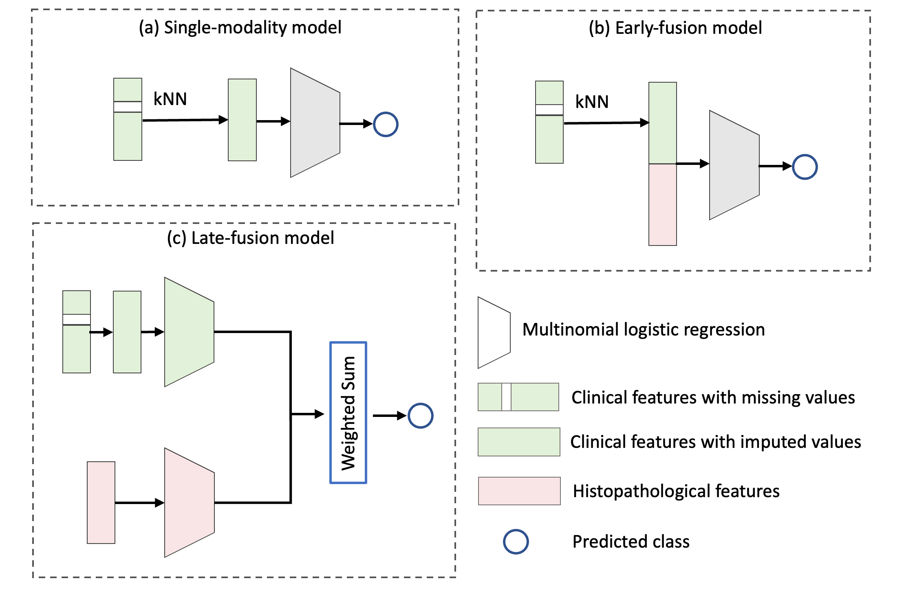

# Erythemato-squamous Subtype Classification Using Multimodal Clinicopathology Variables 

Erythemato-squamous diseases are challenging to classify due to shared clinical and histopathological features. This repository provides models for subtype classification comparing single-modality and multimodal clinicopathology data.

# Installing packages 
Please install `numpy`, `pandas`, `sklearn`, `seaborn`, `scipy`, `matplotlib`. You can use pip install or conda.

# Experiments 
After installing all dependencies, use the `multiclass_logistic_regression_nestedcv.ipynb` notebook to run all single-modality and multimodal models. The notebook contains our implementation of each model and performs model evaluation. 
